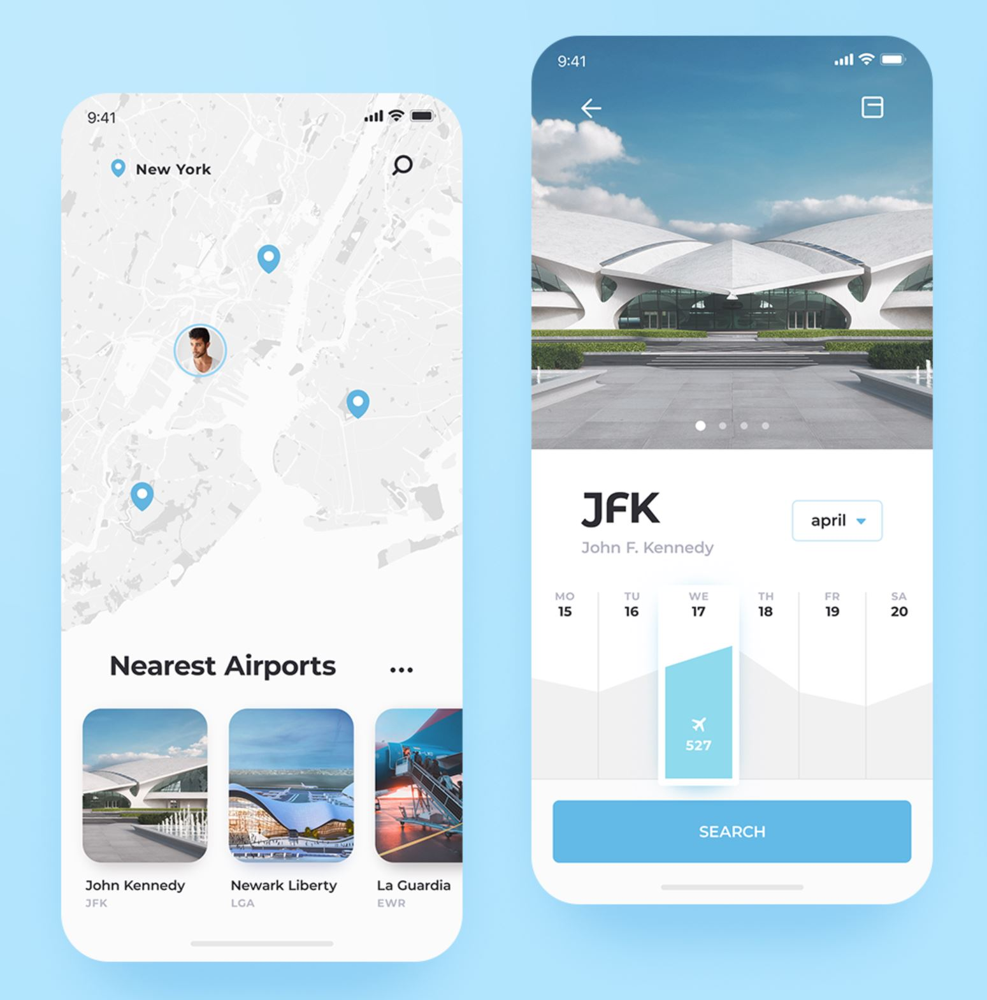
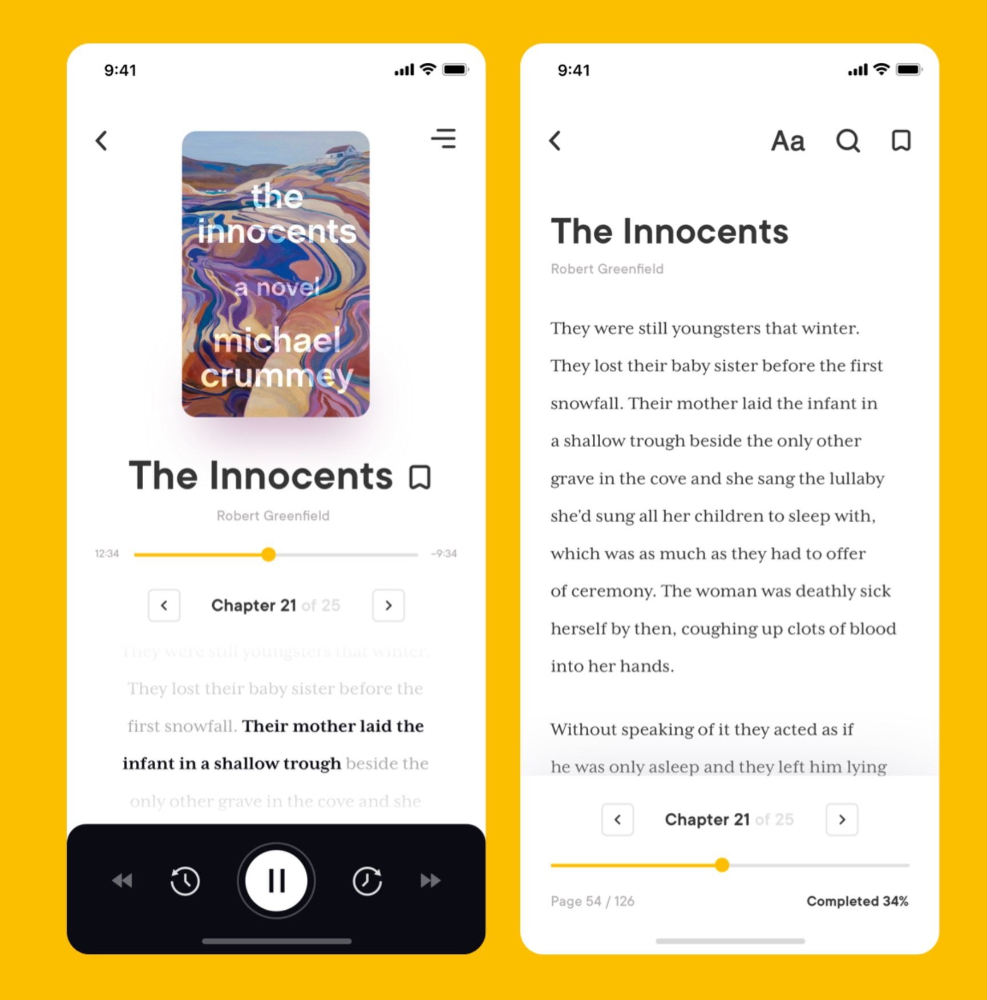
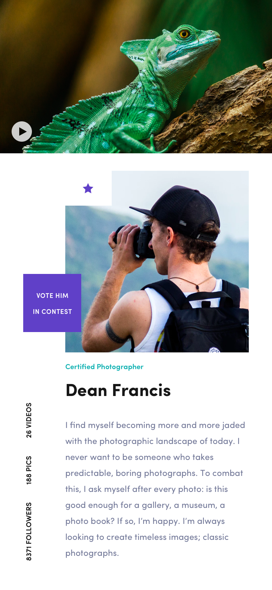
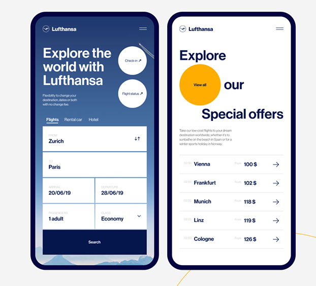

# Design d'applications mobiles - Redesign 10 écrans

## Consignes

Pour le jour de l'examen, vous allez me reproduire, au plus proche, ces 10 écrans.

Essayez de choisir des fontes similaires et des images qui se rapprochent de celles utilisées dans les exemples choisis.

Vous êtes libre d'utiliser le programme de votre choix pour réaliser ce travail mais je vous recommande vivement Adobe XD, Figma, Sketch ou Invision Studio.

Le travail est à uploader sur Github la date d'upload faisant acte du dépôt.

## App 1

## App 2

## App 3

## App 4

## App 5

## App 6

